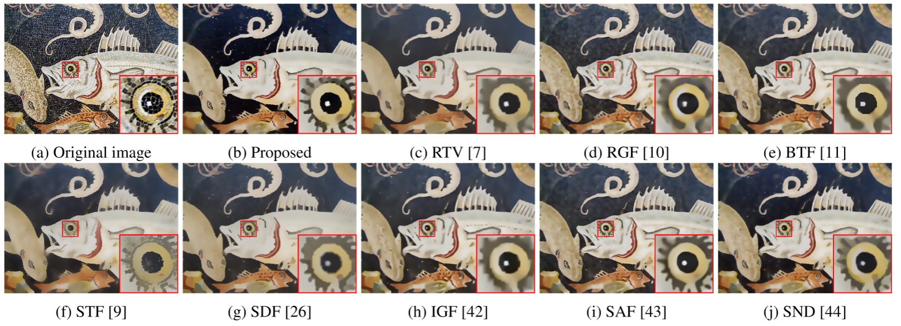

Edge-aware filter based on adaptive patch variance weighted average
========================================================================================================

This repository contains the official MATLAB implementation of GVWA proposed in the following paper: "Edge-aware filter based on adaptive patch variance weighted average" published on 
"IEEE Access 2021". 

    

If you are using this implementation in your research, please consider giving credit by citing our paper:

    @ARTICLE{SSIF_Deng2021,
	    author={F. J. {Galetto} and G. {Deng} and M. {Al-nasrawi} and W. {Waheed}},
	    journal={IEEE Access}, 
	    title={Edge-aware filter based on adaptive patch variance weighted average}, 
	    year={2021},
	    doi={10.1109/ACCESS.2021.3106907}
    }

Link: https://ieeexplore.ieee.org/document/9521149

